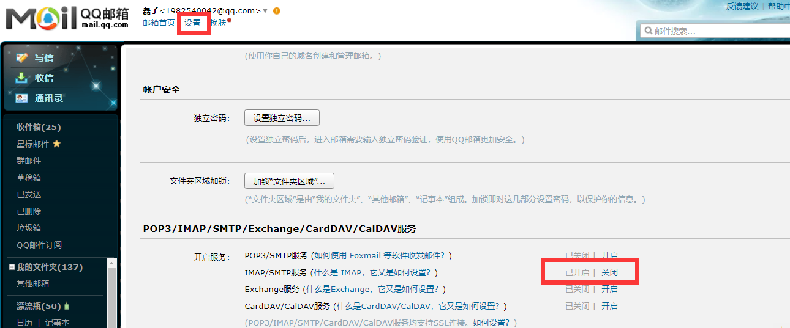
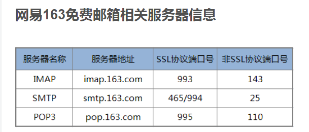

### 前言

在程序中经常使用到邮件发送功能，如何使用flask进行邮件发送呢？Flask是一个扩展性极强的框架，在Flask核心代码上可以自由的扩展功能。比如邮件发送功能，就有flask-mail库，使用该库可以简单的实现邮件发送功能。

### 1.开启QQ发送邮件功能



### 2.使用flask-mail库实现邮件发送功能

#### 2.1安装

```python
pip install flask-mail
```

#### 2.2 功能实现

```python
from flask import Flask
from flask_mail import Mail, Message

from flask_script import Manager

app = Flask(__name__)

app.config["MAIL_SERVER"] = "smtp.qq.com"
app.config["MAIL_PORT"] = 465  # 设置邮箱端口为465，默认为25，由于阿里云禁止了25端口，所以需要修改
app.config["MAIL_USE_SSL"] = True  # 163邮箱需要开启SSL
app.config['MAIL_USE_TLS'] = False

app.config["MAIL_USERNAME"] = "1982540042@qq.com"
app.config["MAIL_PASSWORD"] = "ojwqjuexuhfybagj"  # 这里为开启IMAP/SMTP所获取的授权码

# mail = Mail(app)
mail = Mail()
mail.init_app(app)


@app.route("/send_mail/")
def send_mail():
    """
    发送邮件， sender为发送者邮箱， recipients为接受者邮箱
    """
    message = Message(subject="测试邮件标题", sender=app.config["MAIL_USERNAME"], recipients=["1290368872@qq.com"])
    message.body = "测试邮件的内容1  你好啊!! what are you doing now"
    message.html = "<h1 style='color:red;'>Hello Friend, How Are You ?</h1>"

    # mail.send(message)

    # 或者调用下面的方法
    send_email(message)

    return "邮件1发送成功!"


def send_email(msg):
    with app.app_context():
        mail.send(msg)


manage = Manager(app=app)

if __name__ == "__main__":
    manage.run()
```

设置的参数定义如下:

MAIL_SERVER: 电子邮件服务器的主机名或IP地址， 默认为localhost

MAIL_PORT: 电子邮件服务器的端口，默认为25

MAIL_USE_TLS： 启用传输层安全协议，默认为False

MAIL_USE_SSL： 启用安全套接层协议， 默认为False

MAIL_USERNAME： 邮件账户的用户名

MAIL_PASSWORD：邮件账户的密码，为在163中设置的授权码

### 3. 网易163免费邮箱相关服务器信息如下：

